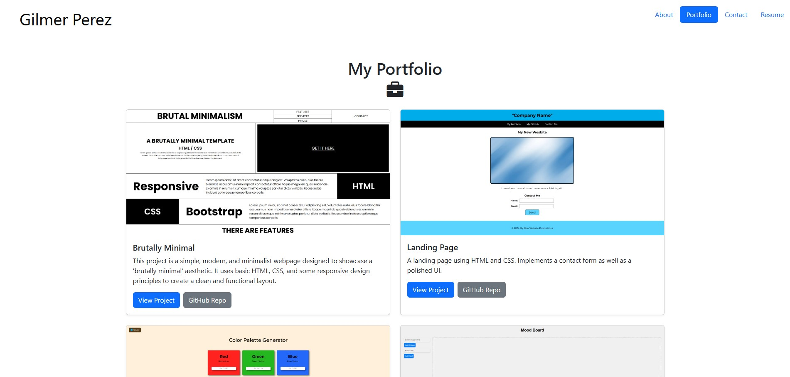

# React Portfolio

## Description

The React Portfolio project is designed to showcase a web developer's skills and projects using React. The portfolio is a single-page application (SPA) built with React, featuring multiple sections like "About Me," "Portfolio," "Contact," and "Resume." The portfolio aims to serve as a tool for job seekers to present their work to potential employers, as well as a platform to highlight their proficiency in React and web development skills.

This project implements key React concepts such as components, routing with `react-router-dom`, and conditional rendering. It also utilizes Bootstrap for responsive design and styling. The portfolio is deployed on Netlify for easy access and sharing.

## Table of Contents

- [Usage](#usage)
- [Mock Up](#mock-up)
- [Instructions](#instructions)
- [Key Features](#key-features)
- [Technology Stack](#technology-stack)
- [Additional Resources](#additional-resources)

## Usage

To start the React portfolio project, follow these steps:

1. Clone the repository:
    ```bash
    git clone <repository-url>
    ```

2. Install dependencies:
    ```bash
    npm install
    ```

3. Start the development server:
    ```bash
    npm run dev
    ```

4. Open the portfolio by navigating to `http://localhost:3000` in your browser.

5. When you're ready to deploy, run:
    ```bash
    npm run build
    ```

6. Follow the [Netlify deployment guide](https://vitejs.dev/guide/static-deploy.html#netlify) for deployment.

## Mock-Up

The following animation shows the web application's appearance and functionality:



## Instructions

1. Clone this repository to your local machine using the command:
    ```bash
    git clone <repository-url>
    ```

2. Install the necessary dependencies using `npm install`.

3. Start the local development server by running `npm run dev`.

4. Open `http://localhost:3000` in your browser to view the portfolio.

5. Modify the `src` directory to personalize your portfolio with your projects, images, bio, contact info, and resume details.

6. After customizing, build the project with `npm run build` and deploy it to Netlify.

## Key Features

- **Responsive Design**: The portfolio adjusts seamlessly to different screen sizes and devices, ensuring it is mobile-friendly.

- **React Components**: The application is built using reusable React components, such as `Header`, `Navigation`, `Project`, and `Footer`.

- **Dynamic Navigation**: Navigation updates dynamically based on the current section, highlighting the active section.

- **Portfolio Section**: Displays projects with clickable links to deployed applications and GitHub repositories.

- **Contact Form**: A simple contact form including name, email and message with validation for required fields and email format.

- **Resume Section**: A list of proficiencies.

- **GitHub and LinkedIn Links**: Links to the developer’s GitHub, LinkedIn and Stack Overflow profiles in the footer.

## Technology Stack

This project relies on the following tools and technologies:

- **React**: Used for building dynamic, component-based user interfaces.

- **react-router-dom**: Manages routing and navigation between sections within the single-page application.

- **Vite**: A modern, fast build tool for developing and bundling the application.

- **Bootstrap**: Provides responsive and mobile-first design for the portfolio layout.

- **Netlify**: Used for deploying the portfolio to the web, making it accessible online.

## Additional Resources

- **React Documentation**: [React Docs](https://reactjs.org/docs/getting-started.html) - Learn how to use React effectively.

- **react-router-dom Documentation**: [React Router Docs](https://reactrouter.com/web/guides/quick-start) - Learn about routing in React applications.

- **Netlify Deployment**: [Deploying with Netlify](https://vitejs.dev/guide/static-deploy.html#netlify) - A guide to deploying a Vite application on Netlify.

- **Bootstrap Documentation**: [Bootstrap Docs](https://getbootstrap.com/docs/5.1/getting-started/introduction/) - Learn more about Bootstrap and its components.


